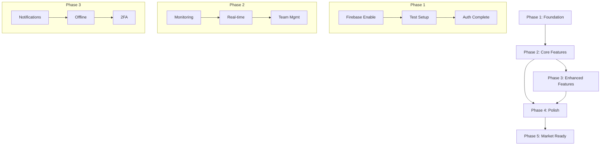

# Master Implementation Roadmap - Claw Master V3

## Document Information
- **Project**: Claw Master V3 - Arcade Inventory & Settings Tracker
- **Created**: December 9, 2024
- **Version**: 1.0.0
- **Timeline**: 10-12 Weeks

---

## Executive Overview

This roadmap outlines the structured approach to completing Claw Master V3 to production-ready status. The plan is organized into 5 phases, each with clear objectives, deliverables, and success criteria.

---

## Timeline Visualization

```
Week 1-2       Week 3-5         Week 6-8          Week 9-10        Week 11-12
|──────────|──────────────|──────────────|─────────────|────────────|
  Phase 1       Phase 2         Phase 3        Phase 4       Phase 5
 Foundation   Core Features    Enhanced      Polish &     Market
              Completion       Features     Optimization   Ready
```

---

## Phase 1: Critical Foundation (Week 1-2)

### Objective
Establish a solid foundation by fixing critical issues, enabling Firebase production mode, and setting up essential infrastructure.

### Goals
- ✅ Enable Firebase production mode
- ✅ Fix all ESLint errors
- ✅ Set up testing infrastructure
- ✅ Complete authentication flow
- ✅ Implement core security measures

### Deliverables

#### Week 1

| Task | Priority | Effort | Owner |
|------|----------|--------|-------|
| Enable Firebase for stock/machine services | P0 | 4h | Dev |
| Fix 8 ESLint errors | P0 | 2h | Dev |
| Configure Jest + Testing Library | P0 | 8h | Dev |
| Add 10 critical unit tests | P0 | 8h | Dev |
| Fix missing hook dependencies | P0 | 2h | Dev |
| Implement proper error boundaries | P1 | 4h | Dev |

#### Week 2

| Task | Priority | Effort | Owner |
|------|----------|--------|-------|
| Add email verification flow | P1 | 8h | Dev |
| Implement rate limiting | P1 | 8h | Dev |
| Complete session management | P1 | 4h | Dev |
| Add input validation (server-side) | P1 | 8h | Dev |
| Set up error monitoring (Sentry) | P1 | 4h | DevOps |
| Write 20 more unit tests | P1 | 8h | Dev |

### Success Criteria
- [ ] `npm run lint` returns 0 errors
- [ ] `npm test` runs successfully with >30% coverage on critical paths
- [ ] Firebase Firestore actively storing/retrieving data
- [ ] New user registration requires email verification
- [ ] Error monitoring dashboard accessible

### Risks & Mitigations

| Risk | Likelihood | Mitigation |
|------|------------|------------|
| Firebase migration breaks mock data | Medium | Keep mock service as fallback |
| Test setup delays | Low | Use minimal config first |

---

## Phase 2: Core Features Completion (Week 3-5)

### Objective
Complete all core functionality gaps, implement the monitoring page, and establish real-time capabilities.

### Goals
- ✅ Complete Real-time Monitoring page
- ✅ Implement WebSocket/SSE for live updates
- ✅ Complete Team management functionality
- ✅ Finish external API integration
- ✅ Complete all CRUD operations

### Deliverables

#### Week 3

| Task | Priority | Effort | Owner |
|------|----------|--------|-------|
| Design Monitoring page UI | P0 | 8h | Dev/UX |
| Implement WebSocket connection | P0 | 16h | Dev |
| Create machine status grid component | P0 | 8h | Dev |
| Build real-time alert panel | P0 | 8h | Dev |
| Integration tests for services | P1 | 8h | Dev |

#### Week 4

| Task | Priority | Effort | Owner |
|------|----------|--------|-------|
| Implement team invite flow | P1 | 8h | Dev |
| Add role editing functionality | P1 | 8h | Dev |
| Complete member removal feature | P1 | 4h | Dev |
| Finish external API sync | P1 | 16h | Dev |
| Add API retry logic & error handling | P1 | 8h | Dev |

#### Week 5

| Task | Priority | Effort | Owner |
|------|----------|--------|-------|
| Complete order notifications | P1 | 8h | Dev |
| Finish maintenance task assignment | P1 | 8h | Dev |
| Add image upload to Firebase Storage | P1 | 8h | Dev |
| Implement stock check history | P1 | 8h | Dev |
| Write integration tests | P1 | 16h | Dev |

### Success Criteria
- [ ] Monitoring page displays live machine data
- [ ] Team invites send functional emails
- [ ] Real-time updates work across browser tabs
- [ ] Image uploads persist to Firebase Storage
- [ ] Test coverage reaches 50%

### Risks & Mitigations

| Risk | Likelihood | Mitigation |
|------|------------|------------|
| External API unstable | Medium | Implement robust error handling |
| WebSocket complexity | Medium | Consider Firebase Realtime DB as alternative |

---

## Phase 3: Enhanced Features (Week 6-8)

### Objective
Implement advanced features including notifications, offline mode, 2FA, and comprehensive analytics exports.

### Goals
- ✅ Complete notification system (email, push)
- ✅ Add offline mode with sync
- ✅ Implement real 2FA
- ✅ Advanced analytics with exports
- ✅ Global search functionality

### Deliverables

#### Week 6

| Task | Priority | Effort | Owner |
|------|----------|--------|-------|
| Integrate email service (SendGrid/Resend) | P1 | 8h | Dev |
| Build email templates | P1 | 8h | Dev |
| Implement push notification service | P2 | 16h | Dev |
| Create notification preferences sync | P2 | 8h | Dev |

#### Week 7

| Task | Priority | Effort | Owner |
|------|----------|--------|-------|
| Add Service Worker for offline | P2 | 16h | Dev |
| Implement IndexedDB caching | P2 | 16h | Dev |
| Build sync queue for offline actions | P2 | 16h | Dev |
| Add conflict resolution UI | P2 | 8h | Dev |

#### Week 8

| Task | Priority | Effort | Owner |
|------|----------|--------|-------|
| Implement TOTP-based 2FA | P2 | 16h | Dev |
| Add QR code generation | P2 | 4h | Dev |
| Build analytics export (CSV/PDF) | P2 | 16h | Dev |
| Implement global search | P2 | 16h | Dev |
| Write E2E tests (Playwright) | P1 | 16h | Dev |

### Success Criteria
- [ ] Email notifications delivered successfully
- [ ] App works offline with pending actions queue
- [ ] 2FA can be enabled and used for login
- [ ] Reports export to CSV/PDF
- [ ] Global search returns relevant results
- [ ] E2E tests cover critical user flows

### Risks & Mitigations

| Risk | Likelihood | Mitigation |
|------|------------|------------|
| Offline sync complexity | High | Start with read-only offline |
| Email deliverability issues | Medium | Use established provider |

---

## Phase 4: Polish & Optimization (Week 9-10)

### Objective
Optimize performance, improve accessibility, refactor large files, and polish the user interface.

### Goals
- ✅ Achieve Lighthouse score 90+
- ✅ Meet WCAG 2.1 AA compliance
- ✅ Refactor files >50KB
- ✅ Improve UI animations and transitions
- ✅ Optimize bundle size

### Deliverables

#### Week 9

| Task | Priority | Effort | Owner |
|------|----------|--------|-------|
| Refactor StockList.tsx (118KB) | P1 | 16h | Dev |
| Refactor StockItemForm.tsx (88KB) | P1 | 16h | Dev |
| Refactor analytics/page.tsx (67KB) | P2 | 12h | Dev |
| Add loading skeletons everywhere | P2 | 8h | Dev |
| Optimize React re-renders | P2 | 8h | Dev |

#### Week 10

| Task | Priority | Effort | Owner |
|------|----------|--------|-------|
| Accessibility audit and fixes | P1 | 16h | Dev |
| Add ARIA labels throughout | P1 | 8h | Dev |
| Keyboard navigation improvements | P1 | 8h | Dev |
| Bundle size optimization | P2 | 8h | Dev |
| Add micro-animations | P2 | 8h | Dev |
| Performance testing | P1 | 8h | QA |

### Success Criteria
- [ ] Lighthouse Performance score ≥90
- [ ] Lighthouse Accessibility score ≥95
- [ ] No file exceeds 30KB
- [ ] Bundle size <500KB
- [ ] All `any` types replaced
- [ ] Keyboard navigation works throughout

### Risks & Mitigations

| Risk | Likelihood | Mitigation |
|------|------------|------------|
| Refactoring introduces bugs | Medium | Comprehensive test coverage first |
| Performance targets not met | Low | Identify bottlenecks early |

---

## Phase 5: Market Readiness (Week 11-12)

### Objective
Complete final preparations for production launch including security hardening, documentation, and deployment setup.

### Goals
- ✅ Pass security audit
- ✅ Complete all documentation
- ✅ Set up production infrastructure
- ✅ Perform load testing
- ✅ Create deployment runbook

### Deliverables

#### Week 11

| Task | Priority | Effort | Owner |
|------|----------|--------|-------|
| Security audit | P0 | 16h | Security |
| Penetration testing | P0 | 16h | Security |
| Fix security vulnerabilities | P0 | 16h | Dev |
| Complete user documentation | P1 | 16h | Tech Writer |
| Create API documentation | P1 | 8h | Dev |

#### Week 12

| Task | Priority | Effort | Owner |
|------|----------|--------|-------|
| Set up production environment | P0 | 8h | DevOps |
| Configure CDN | P0 | 4h | DevOps |
| Set up monitoring & alerting | P0 | 8h | DevOps |
| Load testing | P0 | 8h | QA |
| Create deployment runbook | P0 | 4h | DevOps |
| Final regression testing | P0 | 8h | QA |
| Go-live preparation | P0 | 8h | Team |

### Success Criteria
- [ ] Security audit passed with no critical/high issues
- [ ] Documentation complete for all user personas
- [ ] Production environment stable
- [ ] Load test shows acceptable performance at 2x expected traffic
- [ ] Deployment can be done in <30 minutes
- [ ] Rollback procedure tested

### Risks & Mitigations

| Risk | Likelihood | Mitigation |
|------|------------|------------|
| Security issues discovered late | Medium | Early security review |
| Production environment issues | Low | Test environment parity |

---

## Resource Allocation

### By Phase

| Phase | Dev Hours | QA Hours | DevOps Hours | Total |
|-------|-----------|----------|--------------|-------|
| Phase 1 | 66 | 0 | 4 | 70 |
| Phase 2 | 132 | 0 | 0 | 132 |
| Phase 3 | 140 | 0 | 0 | 140 |
| Phase 4 | 92 | 8 | 0 | 100 |
| Phase 5 | 56 | 16 | 28 | 100 |
| **Total** | **486** | **24** | **32** | **542** |

### Team Composition

| Role | Phase 1-2 | Phase 3-4 | Phase 5 |
|------|-----------|-----------|---------|
| Senior Frontend Dev | 1.0 FTE | 1.0 FTE | 0.5 FTE |
| Frontend Dev | 0.5 FTE | 0.5 FTE | 0.5 FTE |
| Backend Dev | 0.25 FTE | 0.25 FTE | 0.25 FTE |
| QA Engineer | 0 | 0.25 FTE | 0.5 FTE |
| DevOps | 0.1 FTE | 0 | 0.5 FTE |

---

## Milestones & Checkpoints

| Milestone | Target Date | Criteria |
|-----------|-------------|----------|
| M1: Foundation Complete | End of Week 2 | Firebase active, tests running |
| M2: Core Features Complete | End of Week 5 | Monitoring working, team management done |
| M3: Enhanced Features Complete | End of Week 8 | Notifications, offline, 2FA working |
| M4: Optimization Complete | End of Week 10 | Performance benchmarks met |
| M5: Launch Ready | End of Week 12 | All criteria passed |

---

## Dependencies Map



---

## Risk Register

| ID | Risk | Probability | Impact | Mitigation | Owner |
|----|------|-------------|--------|------------|-------|
| R1 | Firebase migration issues | Medium | High | Keep mock fallback | Dev Lead |
| R2 | External API instability | Medium | High | Robust error handling | Dev Team |
| R3 | Scope creep | High | Medium | Strict change control | PM |
| R4 | Resource unavailability | Medium | High | Cross-training | PM |
| R5 | Security vulnerabilities | Medium | Critical | Early security review | Security |
| R6 | Performance not meeting targets | Low | Medium | Early optimization | Dev Team |

---

## Communication Plan

### Status Updates

| Meeting | Frequency | Attendees | Purpose |
|---------|-----------|-----------|---------|
| Daily Standup | Daily | Dev Team | Progress & blockers |
| Sprint Review | Bi-weekly | All Stakeholders | Demo & feedback |
| Phase Gate | End of each phase | Leadership | Go/No-go decision |

### Reporting

| Report | Frequency | Audience |
|--------|-----------|----------|
| Progress Report | Weekly | Stakeholders |
| Risk Report | Weekly | PM & Leadership |
| Test Report | Per Sprint | Dev Team |

---

## Quality Gates

### Per Phase Checklist

- [ ] All planned tasks completed
- [ ] Test coverage meets target
- [ ] No critical bugs open
- [ ] Performance benchmarks met
- [ ] Documentation updated
- [ ] Code review completed
- [ ] Stakeholder sign-off

---

## Appendix: Detailed Implementation Plans

For detailed implementation guidance on specific features, refer to:

- [AUTH_IMPLEMENTATION_PLAN.md](./AUTH_IMPLEMENTATION_PLAN.md)
- [DATA_SYNC_IMPLEMENTATION_PLAN.md](./DATA_SYNC_IMPLEMENTATION_PLAN.md)
- [REAL_TIME_IMPLEMENTATION_PLAN.md](./REAL_TIME_IMPLEMENTATION_PLAN.md)
- [SECURITY_IMPLEMENTATION_PLAN.md](./SECURITY_IMPLEMENTATION_PLAN.md)
- [UI_PAGES_IMPLEMENTATION_PLAN.md](./UI_PAGES_IMPLEMENTATION_PLAN.md)
- [API_IMPLEMENTATION_PLAN.md](./API_IMPLEMENTATION_PLAN.md)
- [PERFORMANCE_OPTIMIZATION_PLAN.md](./PERFORMANCE_OPTIMIZATION_PLAN.md)
- [NOTIFICATIONS_IMPLEMENTATION_PLAN.md](./NOTIFICATIONS_IMPLEMENTATION_PLAN.md)
- [TESTING_IMPLEMENTATION_PLAN.md](./TESTING_IMPLEMENTATION_PLAN.md)
- [DEPLOYMENT_IMPLEMENTATION_PLAN.md](./DEPLOYMENT_IMPLEMENTATION_PLAN.md)
