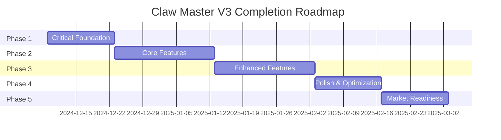

# Claw Master V3 - Executive Summary

## Document Information
- **Project**: Claw Master V3 - Arcade Inventory & Settings Tracker
- **Analysis Date**: December 9, 2024
- **Version**: 1.0.0

---

## 1. Project Overview

### Current State Summary

Claw Master V3 is an **arcade operations management application** built with:

| Technology | Version | Purpose |
|------------|---------|---------|
| Next.js | 16.0.4 | Frontend Framework (App Router) |
| TypeScript | ^5 | Type Safety |
| Firebase | 12.6.0 | Backend (Auth, Firestore, Storage) |
| Tailwind CSS | ^4 | Styling |
| shadcn/ui | Latest | UI Component Library |
| React Hook Form + Zod | ^7 / ^4 | Form Management |
| Recharts | ^3.5.0 | Data Visualization |
| dnd-kit | ^6.3.1 | Drag & Drop |

### Core Features Implemented

| Feature | Status | Completion |
|---------|--------|------------|
| Dashboard | ✅ Functional | 85% |
| Machine Management | ✅ Functional | 80% |
| Inventory System | ✅ Functional | 90% |
| Orders (Kanban) | ✅ Functional | 75% |
| Maintenance | ✅ Functional | 70% |
| Analytics | ✅ Functional | 85% |
| Stock Check | 🟡 Basic | 60% |
| Team Management | 🟡 Basic | 50% |
| Settings | ✅ Functional | 80% |
| Account | ✅ Functional | 85% |
| Monitoring | ❌ Placeholder | 5% |

### Overall Completion Percentage

```
█████████████████████░░░░░░ 72%
```

**Key Achievement**: The application has a solid foundation with a well-organized codebase, modern tech stack, and most core CRUD operations functioning.

---

## 2. Critical Findings

### 2.1 Major Gaps Identified

| Gap | Severity | Impact |
|-----|----------|--------|
| **Firebase Not Active** | 🔴 Critical | Currently using mock services instead of real Firebase |
| **Real-time Monitoring** | 🔴 Critical | Monitoring page is a placeholder |
| **No Test Infrastructure** | 🔴 Critical | Zero unit/integration/e2e tests |
| **Authentication Incomplete** | 🟡 High | Demo mode bypass, no email verification |
| **Real-time Sync Missing** | 🟡 High | No WebSocket/SSE implementation |
| **Offline Mode** | 🟡 High | No offline support or local caching |

### 2.2 Broken/Incomplete Features

| Feature | Issue | Priority |
|---------|-------|----------|
| Monitoring Page | Placeholder only | P0 |
| Team Invite | Button exists, no functionality | P1 |
| Email Notifications | UI exists, backend missing | P1 |
| SMS Notifications | UI exists, backend missing | P2 |
| 2FA | UI simulation only | P2 |
| External API Sync | Basic implementation | P1 |
| Image Upload/Compression | Partial implementation | P2 |

### 2.3 Technical Debt Summary

| Category | Count | Severity |
|----------|-------|----------|
| ESLint Errors | 8 | Medium |
| ESLint Warnings | 40+ | Low |
| `any` Type Usage | 77+ | Medium |
| Large Files (>50KB) | 4 | Medium |
| Missing Hook Dependencies | 3 | High |
| Unused Imports | 15+ | Low |

### 2.4 Security Concerns

| Concern | Status | Notes |
|---------|--------|-------|
| XSS Prevention | ✅ Safe | No dangerouslySetInnerHTML |
| CSRF Protection | ⚠️ Needs Review | Firebase handles auth tokens |
| Input Validation | 🟡 Partial | Client-side with Zod, needs server-side |
| Rate Limiting | ❌ Missing | No rate limiting implemented |
| Audit Logging | 🟡 Partial | Service exists but not fully utilized |

---

## 3. Completion Roadmap

### Total Estimated Timeline: 10-12 Weeks



### Phase 1: Critical Foundation (Week 1-2)
- ✅ Enable Firebase production mode
- ✅ Fix all ESLint errors
- ✅ Implement proper authentication flow
- ✅ Set up basic testing infrastructure
- **Effort**: 80-100 hours

### Phase 2: Core Features (Week 3-5)
- Complete Monitoring page with real-time data
- Implement WebSocket/SSE for live updates
- Complete Team management (invites, role editing)
- Finish external API integration
- **Effort**: 120-150 hours

### Phase 3: Enhanced Features (Week 6-8)
- Implement notification system (email, push)
- Add offline mode with sync
- Complete 2FA implementation
- Advanced analytics with exports
- **Effort**: 120-150 hours

### Phase 4: Polish & Optimization (Week 9-10)
- Performance optimization
- Accessibility improvements
- Large file refactoring
- UI polish and animations
- **Effort**: 60-80 hours

### Phase 5: Market Readiness (Week 11-12)
- Security hardening
- Documentation completion
- Load testing
- Production deployment setup
- **Effort**: 60-80 hours

---

## 4. Priority Recommendations

### Top 10 Critical Actions

| # | Action | Priority | Effort | Impact |
|---|--------|----------|--------|--------|
| 1 | Enable Firebase Production Mode | P0 | 4h | Critical |
| 2 | Fix ESLint Errors | P0 | 2h | High |
| 3 | Set Up Jest + Testing Library | P0 | 8h | High |
| 4 | Implement Monitoring Page | P0 | 40h | High |
| 5 | Complete Email Verification Flow | P1 | 16h | Medium |
| 6 | Implement Real-time Updates | P1 | 40h | High |
| 7 | Complete Team Invite Flow | P1 | 8h | Medium |
| 8 | Add Rate Limiting | P1 | 8h | High |
| 9 | Implement Notification Backend | P2 | 24h | Medium |
| 10 | Add Offline Mode | P2 | 32h | Medium |

### Quick Wins (< 4 hours each)

1. **Enable Firebase** - Replace mock services with real ones
2. **Fix Lint Errors** - Run eslint --fix
3. **Add Loading Skeletons** - Improve perceived performance
4. **Implement Keyboard Shortcuts** - Improve accessibility
5. **Add Empty State Components** - Better UX

### Long-term Strategic Improvements

1. **Microservices Migration** - Consider if scale demands it
2. **GraphQL Implementation** - Better data fetching patterns
3. **PWA Enhancement** - Full offline capability
4. **Mobile App** - React Native companion app
5. **AI Integration** - Smart recommendations, predictive analytics

---

## 5. Market Readiness Status

### Current Readiness Level

```
███████████░░░░░░░░░░░░░░░░ 45%
```

### Blockers to Launch

| Blocker | Severity | Resolution Time |
|---------|----------|-----------------|
| Mock data instead of real DB | 🔴 Critical | 4-8 hours |
| No real-time monitoring | 🔴 Critical | 1-2 weeks |
| Missing test coverage | 🔴 Critical | 2-3 weeks |
| Incomplete authentication | 🟡 High | 1 week |
| No email service integration | 🟡 High | 1 week |

### Path to Production

1. **Week 1-2**: Infrastructure & Critical Fixes
2. **Week 3-4**: Feature Completion
3. **Week 5-6**: Testing & QA
4. **Week 7-8**: Security Audit & Hardening
5. **Week 9-10**: Beta Testing
6. **Week 11-12**: Production Deployment

### Recommended Launch Date

**Target**: End of February 2025 (10-12 weeks from December 9, 2024)

---

## 6. Risk Assessment

### Technical Risks

| Risk | Likelihood | Impact | Mitigation |
|------|------------|--------|------------|
| Firebase connection failures | Medium | High | Demo mode fallback (implemented) |
| Performance degradation with large datasets | Medium | Medium | Implement pagination, virtualization |
| Data loss on browser crash | Low | Medium | Add local storage backup |
| Third-party API instability | Medium | High | Implement retry logic, caching |

### Timeline Risks

| Risk | Likelihood | Impact | Mitigation |
|------|------------|--------|------------|
| Feature creep | High | High | Strict scope management |
| Testing delays | Medium | Medium | Parallel test development |
| Team availability | Medium | Medium | Buffer time in estimates |
| External dependencies | Low | High | Early integration testing |

### Resource Risks

| Risk | Likelihood | Impact | Mitigation |
|------|------------|--------|------------|
| Developer shortage | Medium | High | Document extensively |
| Knowledge concentration | Medium | High | Cross-training, pair programming |
| Infrastructure costs | Low | Medium | Monitor usage, set alerts |

---

## 7. Success Metrics

### Key Performance Indicators

| Metric | Current | Target | Deadline |
|--------|---------|--------|----------|
| Test Coverage | 0% | 80% | Week 10 |
| Lighthouse Performance | Unknown | 90+ | Week 10 |
| Accessibility Score | Unknown | 95+ | Week 10 |
| Build Time | Unknown | < 60s | Week 10 |
| Bundle Size | Unknown | < 500KB | Week 10 |

### Performance Benchmarks

| Metric | Target |
|--------|--------|
| First Contentful Paint | < 1.5s |
| Largest Contentful Paint | < 2.5s |
| Time to Interactive | < 3.5s |
| Total Blocking Time | < 200ms |
| Cumulative Layout Shift | < 0.1 |

### Quality Benchmarks

| Metric | Target |
|--------|--------|
| ESLint Errors | 0 |
| TypeScript Errors | 0 |
| Accessibility Violations | 0 (critical), < 5 (minor) |
| Security Vulnerabilities | 0 (critical/high) |

### User Satisfaction Goals

| Metric | Target |
|--------|--------|
| Task Completion Rate | > 95% |
| Error Rate | < 1% |
| User Onboarding Time | < 5 minutes |
| Feature Discovery | > 80% in first week |

---

## 8. Resource Requirements

### Development Team

| Role | FTE | Duration |
|------|-----|----------|
| Frontend Developer | 1.5 | 12 weeks |
| Backend Developer | 0.5 | 8 weeks |
| QA Engineer | 0.5 | 8 weeks |
| DevOps Engineer | 0.25 | 4 weeks |
| UI/UX Designer | 0.25 | 4 weeks |

### Estimated Total Effort

| Phase | Hours |
|-------|-------|
| Phase 1 | 80-100 |
| Phase 2 | 120-150 |
| Phase 3 | 120-150 |
| Phase 4 | 60-80 |
| Phase 5 | 60-80 |
| **Total** | **440-560 hours** |

### Infrastructure Costs (Monthly)

| Service | Estimated Cost |
|---------|----------------|
| Firebase (Blaze Plan) | $50-200 |
| Vercel (Pro) | $20 |
| Error Monitoring (Sentry) | $26 |
| Email Service (SendGrid) | $20-50 |
| **Total** | **$116-296/month** |

---

## 9. Next Steps

### Immediate Actions (This Week)

1. [ ] Review and approve this Executive Summary
2. [ ] Enable Firebase production mode
3. [ ] Fix all ESLint errors
4. [ ] Set up test infrastructure
5. [ ] Begin Phase 1 implementation

### Stakeholder Decisions Required

1. **Timeline Priority**: Speed vs Quality tradeoff
2. **Feature Scope**: MVP vs Full feature set
3. **Resource Allocation**: Team assignments
4. **Budget Approval**: Infrastructure costs
5. **Launch Strategy**: Phased vs Big bang

---

## 10. Document Index

All detailed documentation is available in the `project-completion-plan/` directory:

- **analysis/** - Audit reports, feature matrices, technical debt
- **architecture/** - System design, database, API, UI/UX blueprints
- **implementation-plans/** - Detailed feature implementation guides
- **enhancements/** - Future improvements and optimizations
- **quality-assurance/** - Testing strategies and quality gates
- **operations/** - Deployment and maintenance plans
- **documentation/** - User guides and training plans
- **readiness/** - Launch checklists and priority matrices

---

*This document serves as the entry point for the Claw Master V3 completion project. All subsequent decisions and implementations should reference this summary and the detailed plans in the documentation structure.*
