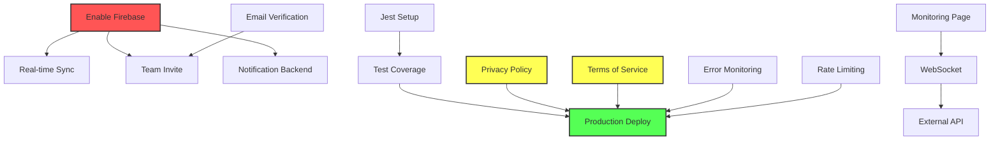

# Implementation Priority Matrix - Claw Master V3

## Document Information
- **Project**: Claw Master V3 - Arcade Inventory & Settings Tracker
- **Analysis Date**: December 9, 2024
- **Version**: 1.0.0

---

## 1. Priority Calculation Formula

```
Priority Score = (Business Value × User Impact) / (Complexity × Risk)
```

### Scoring Scale (1-10)

| Factor | 1-3 (Low) | 4-6 (Medium) | 7-10 (High) |
|--------|-----------|--------------|-------------|
| Business Value | Nice to have | Expected feature | Core functionality |
| User Impact | Few users affected | Most users impacted | All users blocked |
| Complexity | < 8 hours | 8-24 hours | > 24 hours |
| Risk | Low risk | Some dependencies | Critical dependencies |

---

## 2. Priority Categories

| Category | Score Range | Description |
|----------|-------------|-------------|
| **P0 Critical** | > 4.0 | Must complete before any launch |
| **P1 High** | 2.5 - 4.0 | Important for initial launch |
| **P2 Medium** | 1.5 - 2.5 | Should have soon after launch |
| **P3 Low** | < 1.5 | Future improvements |

---

## 3. Complete Priority Matrix

### Infrastructure & Foundation

| Feature | Business Value | User Impact | Complexity | Risk | Priority Score | Category |
|---------|----------------|-------------|------------|------|----------------|----------|
| Enable Firebase production mode | 10 | 10 | 3 | 3 | **11.1** | P0 Critical |
| Fix ESLint errors | 6 | 4 | 2 | 1 | **12.0** | P0 Critical |
| Set up Jest testing | 9 | 8 | 4 | 2 | **9.0** | P0 Critical |
| Add error monitoring (Sentry) | 8 | 7 | 3 | 2 | **9.3** | P0 Critical |
| Fix hook dependencies | 5 | 6 | 2 | 2 | **7.5** | P1 High |

### Authentication & Security

| Feature | Business Value | User Impact | Complexity | Risk | Priority Score | Category |
|---------|----------------|-------------|------------|------|----------------|----------|
| Email verification flow | 8 | 7 | 4 | 3 | **4.7** | P0 Critical |
| Rate limiting | 9 | 6 | 4 | 3 | **4.5** | P0 Critical |
| Real 2FA implementation | 6 | 5 | 5 | 4 | **1.5** | P2 Medium |
| Role management UI | 7 | 6 | 3 | 2 | **7.0** | P1 High |
| Session timeout handling | 5 | 5 | 3 | 2 | **4.2** | P1 High |
| CSRF protection review | 7 | 4 | 3 | 2 | **4.7** | P0 Critical |

### Core Features

| Feature | Business Value | User Impact | Complexity | Risk | Priority Score | Category |
|---------|----------------|-------------|------------|------|----------------|----------|
| Real-time Monitoring page | 10 | 10 | 8 | 6 | **2.1** | P2 Medium |
| WebSocket real-time updates | 8 | 8 | 7 | 5 | **1.8** | P2 Medium |
| Team invite system | 8 | 7 | 5 | 4 | **2.8** | P1 High |
| Notification backend (email) | 8 | 8 | 6 | 5 | **2.1** | P2 Medium |
| Notification backend (push) | 6 | 6 | 6 | 5 | **1.2** | P3 Low |
| External API sync completion | 7 | 6 | 5 | 5 | **1.7** | P2 Medium |

### Data Management

| Feature | Business Value | User Impact | Complexity | Risk | Priority Score | Category |
|---------|----------------|-------------|------------|------|----------------|----------|
| Real-time data sync | 8 | 8 | 6 | 4 | **2.7** | P1 High |
| Offline mode | 6 | 7 | 8 | 6 | **0.9** | P3 Low |
| Conflict resolution | 5 | 5 | 6 | 5 | **0.8** | P3 Low |
| Data pagination | 6 | 6 | 4 | 3 | **3.0** | P1 High |
| Audit trail completion | 6 | 5 | 4 | 3 | **2.5** | P1 High |

### User Experience

| Feature | Business Value | User Impact | Complexity | Risk | Priority Score | Category |
|---------|----------------|-------------|------------|------|----------------|----------|
| Global search | 7 | 8 | 5 | 3 | **3.7** | P1 High |
| Breadcrumb navigation | 4 | 5 | 2 | 1 | **10.0** | P0 Critical |
| Loading skeletons | 5 | 7 | 3 | 1 | **11.7** | P0 Critical |
| Empty states | 5 | 6 | 3 | 1 | **10.0** | P0 Critical |
| Keyboard shortcuts | 4 | 4 | 3 | 2 | **2.7** | P1 High |
| Accessibility improvements | 7 | 6 | 5 | 2 | **4.2** | P1 High |

### Analytics & Reporting

| Feature | Business Value | User Impact | Complexity | Risk | Priority Score | Category |
|---------|----------------|-------------|------------|------|----------------|----------|
| Report export (CSV/PDF) | 6 | 6 | 4 | 3 | **3.0** | P1 High |
| Custom report builder | 5 | 4 | 6 | 4 | **0.8** | P3 Low |
| Scheduled reports | 4 | 3 | 5 | 4 | **0.6** | P3 Low |

### Technical Improvements

| Feature | Business Value | User Impact | Complexity | Risk | Priority Score | Category |
|---------|----------------|-------------|------------|------|----------------|----------|
| Refactor StockList.tsx | 6 | 4 | 5 | 3 | **1.6** | P2 Medium |
| Refactor StockItemForm.tsx | 6 | 4 | 5 | 3 | **1.6** | P2 Medium |
| Replace all `any` types | 5 | 3 | 6 | 2 | **1.3** | P3 Low |
| Bundle size optimization | 5 | 5 | 4 | 2 | **3.1** | P1 High |
| Performance optimization | 6 | 7 | 5 | 3 | **2.8** | P1 High |

### Documentation & Compliance

| Feature | Business Value | User Impact | Complexity | Risk | Priority Score | Category |
|---------|----------------|-------------|------------|------|----------------|----------|
| Privacy policy | 10 | 5 | 2 | 1 | **25.0** | P0 Critical |
| Terms of service | 10 | 5 | 2 | 1 | **25.0** | P0 Critical |
| Cookie consent banner | 8 | 4 | 2 | 1 | **16.0** | P0 Critical |
| User documentation | 7 | 7 | 5 | 2 | **4.9** | P0 Critical |
| API documentation | 6 | 4 | 4 | 2 | **3.0** | P1 High |

### Operations

| Feature | Business Value | User Impact | Complexity | Risk | Priority Score | Category |
|---------|----------------|-------------|------------|------|----------------|----------|
| CI/CD pipeline | 8 | 5 | 5 | 3 | **2.7** | P1 High |
| Production deployment | 10 | 10 | 4 | 4 | **6.3** | P0 Critical |
| Backup verification | 8 | 7 | 3 | 2 | **9.3** | P0 Critical |
| Disaster recovery plan | 7 | 6 | 4 | 3 | **3.5** | P1 High |

---

## 4. Sorted by Priority Score

### P0 Critical (Must Complete Before Launch)

| Rank | Feature | Score | Effort |
|------|---------|-------|--------|
| 1 | Privacy policy | 25.0 | 2h |
| 2 | Terms of service | 25.0 | 2h |
| 3 | Cookie consent banner | 16.0 | 2h |
| 4 | Fix ESLint errors | 12.0 | 2h |
| 5 | Loading skeletons | 11.7 | 6h |
| 6 | Enable Firebase production | 11.1 | 8h |
| 7 | Breadcrumb navigation | 10.0 | 4h |
| 8 | Empty states | 10.0 | 6h |
| 9 | Error monitoring (Sentry) | 9.3 | 6h |
| 10 | Backup verification | 9.3 | 4h |
| 11 | Set up Jest testing | 9.0 | 16h |
| 12 | Production deployment | 6.3 | 8h |
| 13 | User documentation | 4.9 | 16h |
| 14 | CSRF protection review | 4.7 | 4h |
| 15 | Email verification | 4.7 | 12h |
| 16 | Rate limiting | 4.5 | 12h |

**Total P0 Effort**: ~110 hours

### P1 High (Important for Initial Launch)

| Rank | Feature | Score | Effort |
|------|---------|-------|--------|
| 1 | Fix hook dependencies | 7.5 | 2h |
| 2 | Role management UI | 7.0 | 8h |
| 3 | Session timeout | 4.2 | 4h |
| 4 | Accessibility improvements | 4.2 | 16h |
| 5 | Global search | 3.7 | 16h |
| 6 | Disaster recovery plan | 3.5 | 8h |
| 7 | Bundle size optimization | 3.1 | 8h |
| 8 | API documentation | 3.0 | 8h |
| 9 | Report export | 3.0 | 12h |
| 10 | Data pagination | 3.0 | 8h |
| 11 | Performance optimization | 2.8 | 12h |
| 12 | Team invite system | 2.8 | 16h |
| 13 | CI/CD pipeline | 2.7 | 8h |
| 14 | Keyboard shortcuts | 2.7 | 6h |
| 15 | Real-time data sync | 2.7 | 20h |
| 16 | Audit trail completion | 2.5 | 8h |

**Total P1 Effort**: ~160 hours

### P2 Medium (Should Have Soon After Launch)

| Rank | Feature | Score | Effort |
|------|---------|-------|--------|
| 1 | Real-time Monitoring page | 2.1 | 40h |
| 2 | Notification backend (email) | 2.1 | 24h |
| 3 | WebSocket real-time updates | 1.8 | 30h |
| 4 | External API sync | 1.7 | 16h |
| 5 | Refactor StockList.tsx | 1.6 | 16h |
| 6 | Refactor StockItemForm.tsx | 1.6 | 16h |
| 7 | Real 2FA implementation | 1.5 | 20h |

**Total P2 Effort**: ~162 hours

### P3 Low (Future Improvements)

| Rank | Feature | Score | Effort |
|------|---------|-------|--------|
| 1 | Replace all `any` types | 1.3 | 24h |
| 2 | Notification backend (push) | 1.2 | 20h |
| 3 | Offline mode | 0.9 | 40h |
| 4 | Custom report builder | 0.8 | 24h |
| 5 | Conflict resolution | 0.8 | 20h |
| 6 | Scheduled reports | 0.6 | 16h |

**Total P3 Effort**: ~144 hours

---

## 5. Quick Wins (High Impact, Low Effort)

| Feature | Score | Effort | Why It's a Win |
|---------|-------|--------|----------------|
| Privacy policy | 25.0 | 2h | Legal requirement, template available |
| Terms of service | 25.0 | 2h | Legal requirement, template available |
| Cookie consent | 16.0 | 2h | Simple library integration |
| Fix ESLint errors | 12.0 | 2h | Improves code quality |
| Breadcrumbs | 10.0 | 4h | Better navigation UX |
| Loading skeletons | 11.7 | 6h | Improved perceived performance |
| Empty states | 10.0 | 6h | Better first-time UX |

**Total Quick Wins Effort**: ~26 hours for significant improvement

---

## 6. Implementation Order Recommendation

### Sprint 1 (Week 1-2): Foundation

1. ✅ Privacy policy & Terms of service
2. ✅ Cookie consent banner
3. ✅ Fix ESLint errors
4. ✅ Enable Firebase production
5. ✅ Error monitoring setup
6. ✅ Email verification

### Sprint 2 (Week 3-4): Core Quality

1. ✅ Set up Jest + initial tests
2. ✅ Loading skeletons
3. ✅ Empty states
4. ✅ Breadcrumb navigation
5. ✅ Rate limiting
6. ✅ CSRF review

### Sprint 3 (Week 5-6): Features

1. ✅ Team invite system
2. ✅ Role management UI
3. ✅ Real-time data sync
4. ✅ Global search
5. ✅ Accessibility improvements

### Sprint 4 (Week 7-8): Documentation & Polish

1. ✅ User documentation
2. ✅ API documentation
3. ✅ Report export
4. ✅ Performance optimization
5. ✅ CI/CD pipeline

### Sprint 5 (Week 9-10): Monitoring & Operations

1. ✅ Real-time Monitoring page
2. ✅ Notification backend
3. ✅ Disaster recovery plan
4. ✅ Production deployment

### Sprint 6 (Week 11-12): Post-Launch

1. ✅ Refactoring large files
2. ✅ 2FA implementation
3. ✅ Remaining P2 items

---

## 7. Resource Allocation by Priority

### By Category

| Priority | Features | Total Effort | % of Total |
|----------|----------|--------------|------------|
| P0 Critical | 16 | ~110h | 19% |
| P1 High | 16 | ~160h | 28% |
| P2 Medium | 7 | ~162h | 28% |
| P3 Low | 6 | ~144h | 25% |
| **Total** | **45** | **~576h** | **100%** |

### By Phase

| Phase | Categories | Hours | Timeline |
|-------|------------|-------|----------|
| Foundation | P0 | 110h | Week 1-2 |
| Core | P0 + P1 (partial) | 80h | Week 3-4 |
| Features | P1 | 80h | Week 5-6 |
| Polish | P1 + P2 (partial) | 80h | Week 7-8 |
| Operations | P2 | 82h | Week 9-10 |
| Post-Launch | P2 + P3 | 144h | Week 11-12+ |

---

## 8. Dependencies Visualization



---

## 9. Risk-Adjusted Priorities

Some features have higher implementation risk. Adjusted priorities:

| Feature | Base Priority | Risk Factor | Adjusted Priority | Notes |
|---------|---------------|-------------|-------------------|-------|
| Real-time Monitoring | P2 | High | P2 (start early) | External API dependency |
| Offline Mode | P3 | High | P3 (defer) | Complex, can wait |
| 2FA | P2 | Medium | P2 | Security libraries needed |
| Global Search | P1 | Low | P1 | Straightforward |

---

## 10. Conclusion

### Focus Order

1. **Immediate** (This Week): Legal documents, ESLint, Firebase
2. **Short-term** (2-4 Weeks): Testing, UX improvements, security
3. **Medium-term** (4-8 Weeks): Core features, documentation
4. **Long-term** (8+ Weeks): Monitoring, optimizations, P3 features

### Key Takeaways

- **Quick wins** can dramatically improve production readiness
- **Legal requirements** are non-negotiable blockers
- **Testing infrastructure** enables safe development
- **Firebase enablement** unblocks most other features
- **Monitoring page** is the largest single feature gap
